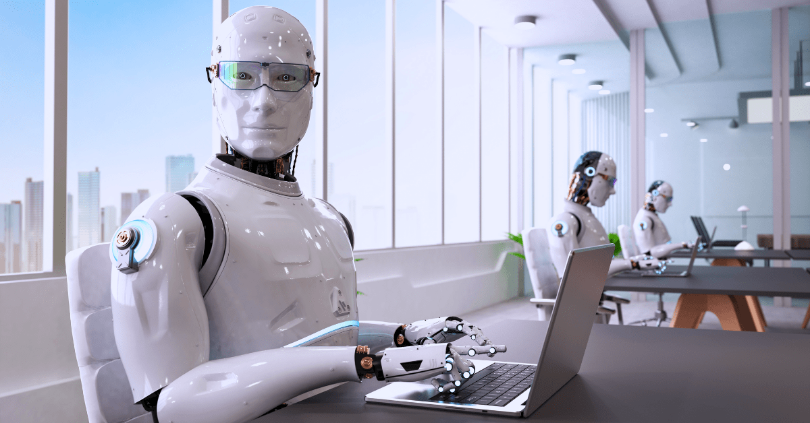

# A Brief History of Artificial Intelligence: From Concept to Reality #

Artificial Intelligence (AI) is a field of computer science that aims to create machines capable of intelligent behavior. The concept of AI has a long and rich history, dating back to ancient times. Let's explore the key milestones in the development of AI, from its inception to its current state.

## Early Beginnings ##

The idea of artificial beings with human-like intelligence can be traced back to ancient mythology and folklore. However, the formal study of AI began in the mid-20th century. In 1956, the term "Artificial Intelligence" was coined at the Dartmouth Summer Research Project on Artificial Intelligence, where researchers gathered to discuss how machines could simulate human intelligence.

## The Early Years: Symbolic AI ##

In the early years of AI research, the focus was on symbolic AI, which involved programming computers to manipulate symbols and logic. This approach led to the development of expert systems, which could reason and make decisions based on rules and knowledge.

## The Rise of Machine Learning ##

In the 1980s and 1990s, AI research shifted towards machine learning, a subfield of AI that focuses on the development of algorithms that can learn from and make predictions or decisions based on data. This shift led to significant advancements in AI, including the development of neural networks and deep learning algorithms.

## AI in the 21st Century ##

The 21st century has seen rapid progress in AI, driven by advances in computing power and the availability of large datasets. AI is now being used in a wide range of applications, from speech recognition and natural language processing to autonomous vehicles and medical diagnosis.

## Ethical and Societal Implications ##

The development of AI has raised important ethical and societal questions, including concerns about job displacement, bias in AI algorithms, and the impact of AI on privacy and security. Addressing these issues will be crucial as AI continues to advance.

## The Future of AI ##

Looking ahead, the future of AI holds great promise. AI has the potential to transform industries, improve healthcare, and enhance our quality of life. However, realizing this potential will require careful consideration of the ethical, legal, and social implications of AI.

**In conclusion**, the history of AI is a story of innovation and progress. From its early beginnings to its current state, AI has evolved into a powerful technology with the potential to shape the future of humanity. As we continue to explore the possibilities of AI, it is essential to approach its development with caution and foresight, ensuring that AI benefits society as a whole.**

