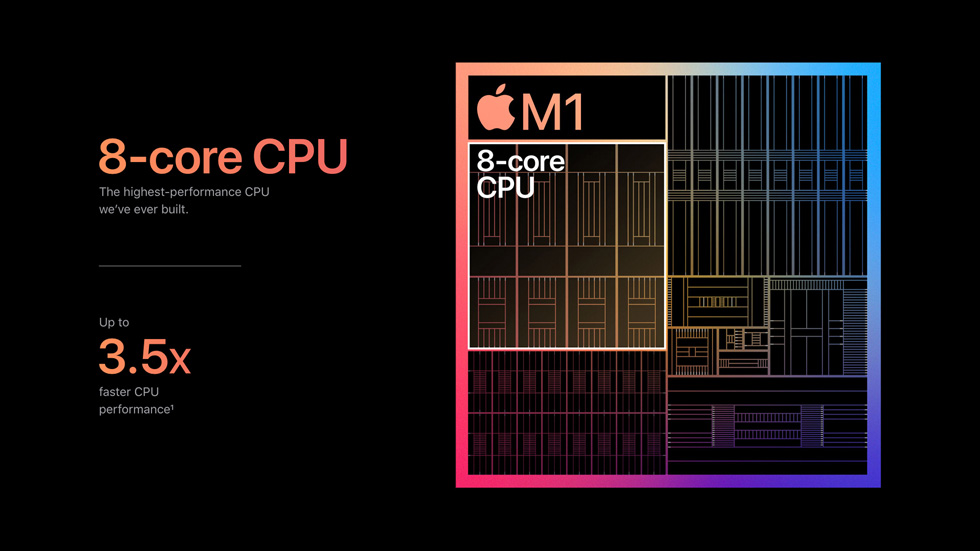

# CPUs and Transistors: The Building Blocks of Modern Computing #

Central Processing Units (CPUs) are the brains of modern computing devices, performing billions of calculations per second to execute instructions and run applications. At the heart of every CPU are transistors, tiny electronic components that switch on and off to process and store information. Let's explore the relationship between CPUs and transistors, and how they work together to power the digital world.

## The Transistor Revolution ##

Transistors were invented in 1947 by John Bardeen, Walter Brattain, and William Shockley at Bell Labs. These tiny semiconductor devices replaced bulky and less efficient vacuum tubes, revolutionizing electronics. Transistors can act as switches or amplifiers, making them ideal for building complex digital circuits.

## From Transistors to CPUs ##

CPUs are complex integrated circuits that contain millions, or even billions, of transistors. These transistors are organized into logic gates, which are the building blocks of digital circuits. Logic gates perform basic operations such as AND, OR, and NOT, allowing the CPU to process data and execute instructions.

## How CPUs Work ##

+ **Fetch**: The CPU retrieves instructions from memory.
+ **Decode**: The CPU decodes the instructions to determine what operation to perform.
+ **Execute**: The CPU executes the instruction, performing calculations or moving data.
+ **Writeback**: The CPU writes the result back to memory or a register.
Moore's Law and the Future of CPUs

Moore's Law, formulated by Intel co-founder Gordon Moore in 1965, states that the number of transistors on a chip doubles approximately every two years. This law has held true for several decades, driving the rapid advancement of CPUs. However, as transistors approach atomic scale, researchers are exploring new technologies such as quantum computing and neuromorphic computing to continue the growth of computing power.

 Conclusion 

CPUs and transistors are fundamental to modern computing, enabling the digital revolution that has transformed society. As technology continues to evolve, so too will CPUs and transistors, ushering in a new era of innovation and discovery in the world of computing.