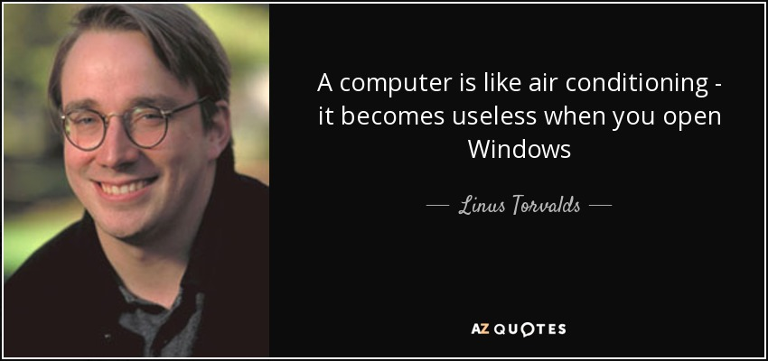

# Linus Torvalds #

> Git was created by Linus Torvalds, the same person who created the Linux operating system kernel. Torvalds developed Git in 2005 to manage the source code of the Linux kernel development, aiming to address the limitations of existing version control systems at the time. His goal was to create a fast, efficient, and distributed version control system that could handle the complex and collaborative nature of the Linux kernel development process.

[Linus Trovals]((https://en.wikipedia.org/wiki/Linus_Torvalds)) read more aoubt hime his Wikipidia page!

  

## Linus Torvalds Quotes: ##

Most good programmers do programming not because they expect to get paid or get adulation by the public, but because it is fun to program. 🤔

I often compare open source to science. To where science took this whole notion of developing ideas in the open and improving on other peoples' ideas and making it into what science is today and the incredible advances that we have had. And I compare that to witchcraft and alchemy, where openness was something you didn't do.  

- read more at:  https://www.brainyquote.com/authors/linus-torvalds-quotes 

